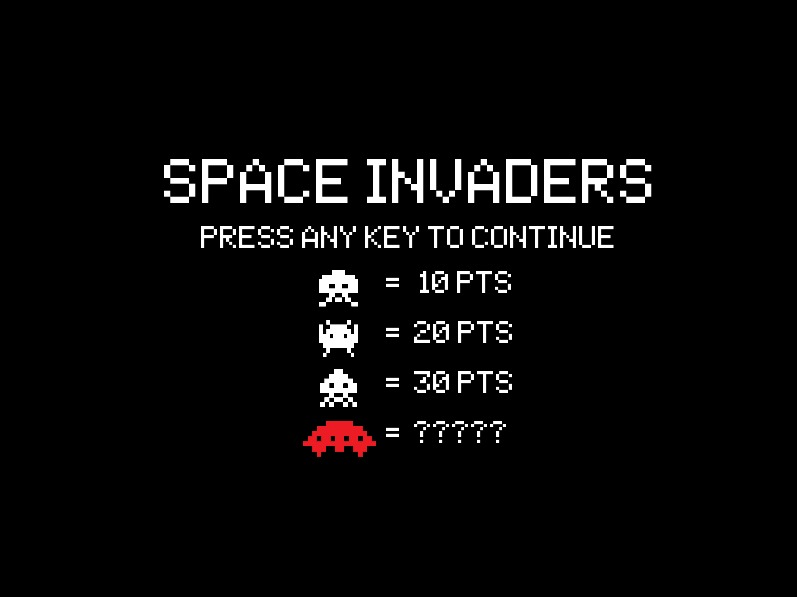
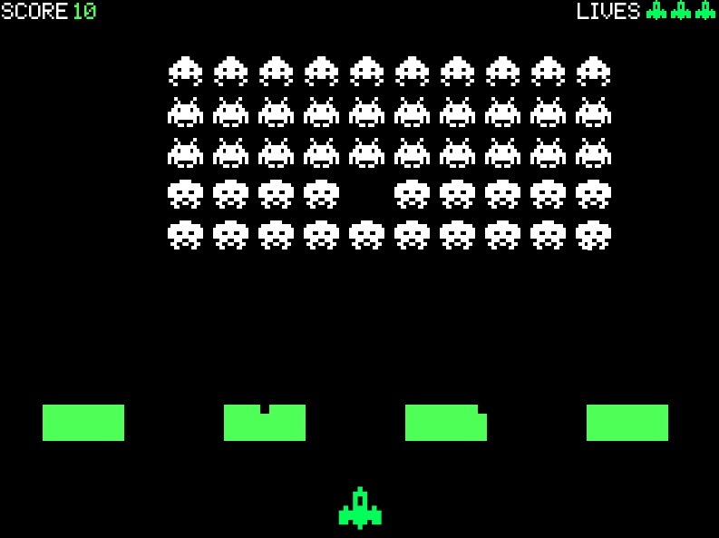
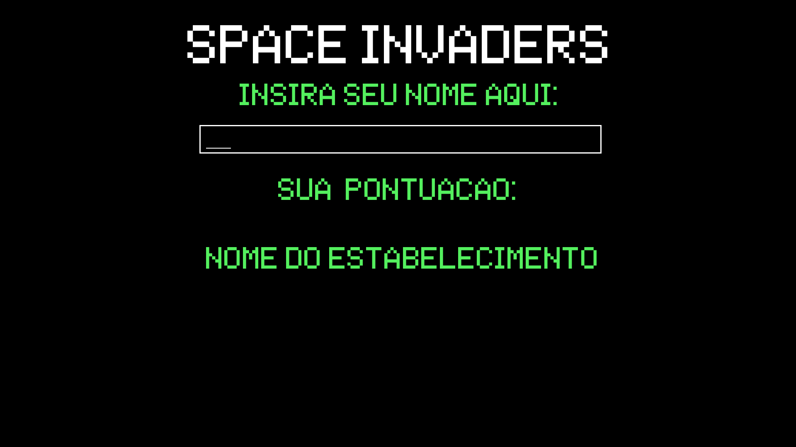
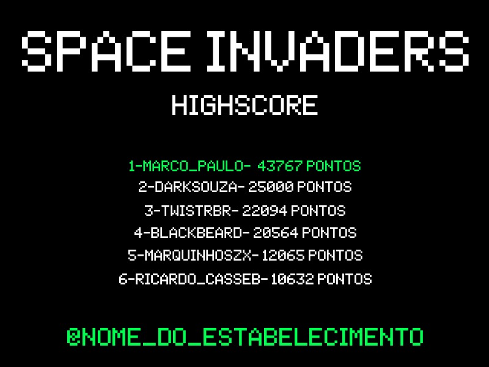

# Mini_Arcade

O Mini_Arcade é um console pensado para ser utilizado em bares e barbearias, providenciando entretenimento, visibilidade e aproveitamento do espaço de um estabelecimento.

# Telas do jogo

Aqui estão prototipos das telas que o usuário terá acesso.

# Tela inicial de jogo

# Tela de gameplay

# Tela de cadastro do usuário

# Tela de highscore do sistema

# Colaboradores
André Akira Prazeres Yamase\
@anded-acdc@hotmail.com\
\
Brian Bomfim Amaral\
brianamaral918@gmail.com\
\
Thiago Alonso Teixeira do Nascimento Cabral\
thiagoalonsoc27@gmail.com\
